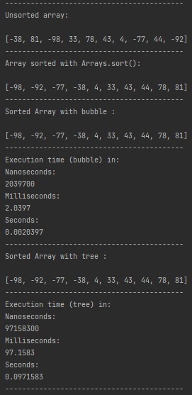
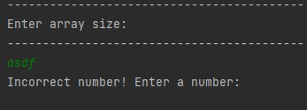
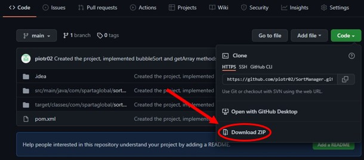
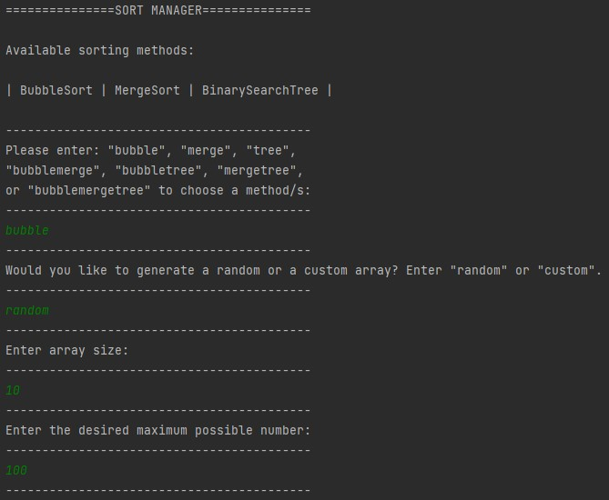
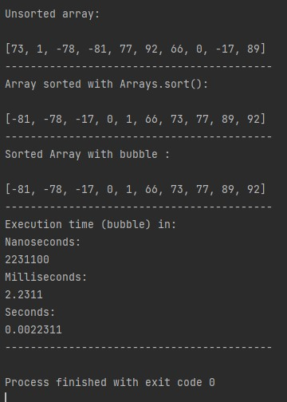

# Sort Manager Project

## Table of Contents
[Description](https://github.com/piotr02/sortmanager#description)

[Implementation](https://github.com/piotr02/sortmanager#implementation)

[Tools Used](https://github.com/piotr02/sortmanager#tools-used)

[Requirements](https://github.com/piotr02/sortmanager#requirements)

* [Phase 1](https://github.com/piotr02/sortmanager#phase-1)
* [Phase 2](https://github.com/piotr02/sortmanager#phase-2)
* [Phase 3](https://github.com/piotr02/sortmanager#phase-3)
* [Phase 4](https://github.com/piotr02/sortmanager#phase-4)
* [Phase 5](https://github.com/piotr02/sortmanager#phase-5)

[Testing](https://github.com/piotr02/sortmanager#testing)

* [JUnit Tests](https://github.com/piotr02/sortmanager#junit-tests)
* [Manual Testing](https://github.com/piotr02/sortmanager#manual-testing)
* [Input Validation](https://github.com/piotr02/sortmanager#input-validation)

[Tools Required To Run The Project](https://github.com/piotr02/sortmanager#tools-required-to-run-the-project)

[Dependencies](https://github.com/piotr02/sortmanager#dependencies)

[How To Set Up The Project](https://github.com/piotr02/sortmanager#how-to-set-up-the-project)

[How To Use The Project](https://github.com/piotr02/sortmanager#how-to-use-the-project)

## Description
The program sorts arrays of integers using 3 sorting
algorithms: bubble sort, merge sort, and a binary
search tree.

The user is able to generate a random
array of desired size and with numbers within 
a desired range. The user can also manually input
values into the array.

Any combination of sorting algorithms can be chosen
to sort the same array. The output shows the time
each algorithm took in nanoseconds, milliseconds,
and seconds. It also shows the same array sorted
with the Arrays.sort() method for comparison.

The image below shows the console output:



## Implementation
The structure of the code follows the MVC architecture,
the 4 pillars of Object-Oriented Programming, and
the SOLID principles. The classes are divided into
packages: "model", "view", and "controller", there are 4 test
classes, and a "resources" folder containing log4j2.properties file
and the log output file called "mylogfile.log".

The project was implemented in 5 phases, within 1 week.
The details about each phase are available in the
[Requirements](https://github.com/piotr02/sortmanager#requirements) section.

## Tools Used
1. IntelliJ IDEA Ultimate
2. Java 17 JDK
3. Apache Maven
4. Apache log4j
5. GitHub

## Requirements

### Phase 1
BubbleSort and MergeSort algorithms have their
own classes, found in the "Model" package.

JUnit tests were made for each sorting algorithm
and the ArrayGenerator class.

### Phase 2
The MVC architecture, 4 pillars of Object-Oriented
Programming and the SOLID principles were implemented
in this phase. A factory pattern was implemented for 
the sorting methods (BinarySearchTreeFacadeFactory,
BubbleSortFactory, and MergeSortFactory) to determine
which algorithm to use based on user input.

An interface (SortInterface) was implemented to be
used by all sorting algorithm classes.

The "model" package has the following classes:
ArrayGenerator
BinarySearchTree
BinarySearchTreeFacade
BinarySearchTreeFacadeFactory
BubbleSort
BubbleSortFactory
MergeSort
MergeSortFactory
SortFactory
SortInterface

The "view" package has a DisplayManager class, 
responsible for the output.

The "controller" package has a SortManager class, 
responsible for executing the sorting.

The main method is located in the com.spartaglobal.sortmanager
package.

### Phase 3
Logging code was implemented with the use of log4j, 
with a log4j2.properties file, located in the "resources"
folder. Logs of different levels were inserted into
the code, to show different stages of the program. The
Output of the logs is stored in the "mylogfile.log"
file in the "resources" folder.

### Phase 4
A binary search tree (BinarySearchTree class) sorting
method was implemented to work with previously
created interface. A facade pattern was used (BinarySearchTreeFacade)
to pass in an unsorted array and return a sorted one.

A node in the binary search tree is represented by
a nested class Node in the BinarySearchTree class.

### Phase 5
System.nanoTime() was used to calculate how long
each sorting method took. Changes to the code were
made to allow the user to select multiple sorting
methods. The output displays the timings of each method
in nanoseconds, milliseconds, and seconds, allowing
for easy comparison.

## Testing
Classes BubbleSort, MergeSort, and BinarySearchTreeFacade
were fully tested with JUnit tests (with 100% line coverage).
ArrayGenerator class was tested with a single JUnit test,
as the methods require user input. The rest of the methods
in this class was tested manually. The rest of the classes
were also tested manually.

Validation code was also implemented to prevent incorrect
user input, making up for the inability to test certain
methods with JUnit tests (E.g. it is not possible
to enter a String value for the array size, and the
array size will automatically convert negative
numbers to avoid the program throwing an exception
(the user is notified of this operation)).

### JUnit Tests
Each sorting method was tested with the following tests:
- Check if the algorithm works correctly with an empty array
- Check if the algorithm works correctly with negative numbers in the array
- Check if the algorithm works correctly with an array of uneven length
- Check if the algorithm works correctly with an array with one value
- Check if the algorithm works correctly with an array with duplicate values
- Check if the algorithm works correctly with a null array
- Check if the algorithm works correctly with an array with a max integer value
- Check if the algorithm works correctly with an array with a min integer value
- Check if the algorithm works correctly with an array with identical values

The ArrayGenerator class was tested with one unit test:
- Check if the randomly generated array has the desired array length

### Manual Testing
Due to the structure of some methods, a large part of the code
had to be tested manually. E.g. many methods require user input which is
validated before passing the values into parts of the code that may break
or throw and exception, making it hard to test with unit tests.

List of the manual tests:
- Checking if all sorting methods can be entered and run the corresponding sorting methods
- Checking if the program responds correctly to a user entering an unspecified method
- Checking if the case of the letters matters
- Checking if any combination of sorting methods can be selected and outputs the correct result
- Checking if entering incorrect values loops back, allowing the user to try again, with a proper notification
- Checking what happens when an incorrect array type, size, or bounds is entered
- Checking if the same array is not being sorted multiple times
- Checking if the algorithm timings make sense (considering the complexity of algorithms, some should be faster than others)
- Checking if the output is displayed in a clean and readable way

### Input validation
To avoid the program throwing exceptions, some input validation was implemented.
While choosing a sorting method, the user is informed
about the available methods. If they enter an incorrect
method name, the following message will be displayed: "Incorrect method! Try again: ".
The user will then be able to enter the method name again.
Similar validation has been applied to entering the desired
size of the array, the maximum value of each element, and in case of
a custom array, each value entered by the user.
If a negative number is entered, it will be automatically converted
into a positive one and the user will be notified of
that. 

Example of input validation:


## Tools Required To Run The Project
1. IntelliJ IDEA Community or Ultimate Edition
2. Java 17 JDK

## Dependencies
```xml
<dependencies>
        <dependency>
            <groupId>org.junit.jupiter</groupId>
            <artifactId>junit-jupiter</artifactId>
            <version>5.8.2</version>
        </dependency>
        <dependency>
            <groupId>org.apache.logging.log4j</groupId>
            <artifactId>log4j-core</artifactId>
            <version>2.17.1</version>
        </dependency>
    </dependencies>
```

## How To Set Up The Project
1. Download the repository as shown in the image 
below:

    
2. Unzip the downloaded file.
3. Paste the folder named "SortManager-main" into your
IntelliJ project directory and rename it to
"SortManager".
4. Open up IntelliJ and load the project
in File > Open, then select SortManager from
your project directory.

## How To Use The Project
1. Run the main method in SortManagerMain class
2. Type in one of the options displayed in the console to select a desired sorting method or multiple
3. Enter "random" if you wish to generate a random array, or "custom" to input your own values
4. If you chose "random" enter a number for the array size, and then a number for the range of the array values. If you chose "custom", enter the array size, and then type in your values, one at a time
5. The chosen sorting methods will now execute and the output will be visible in the console.

For instance, the following input:



Will result in the following output (the array will be different each time):



